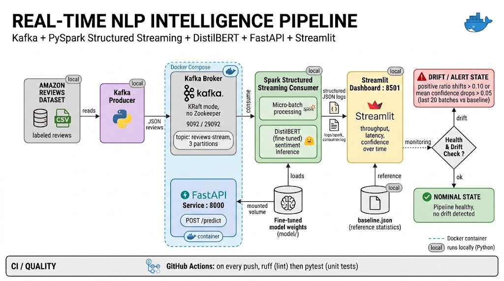
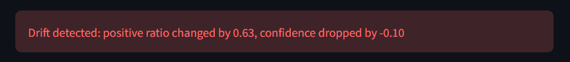

# ReviewRadar: Real-Time NLP Intelligence Pipeline

[](https://github.com/Mohamed-Halloud/ReviewRadar/actions/workflows/tests.yml)


> End-to-end data and AI pipeline: Amazon product reviews are streamed through Kafka, scored by a fine-tuned DistilBERT model with PySpark Structured Streaming, served through a FastAPI endpoint, and monitored live with a Streamlit dashboard that includes **model drift detection**.

---

## Table of Contents

1. [Overview](#overview)
2. [Architecture](#architecture)
3. [Key Features](#key-features)
4. [Tech Stack](#tech-stack)
5. [Results](#results)
6. [Screenshots](#screenshots)
7. [Project Structure](#project-structure)
8. [Getting Started](#getting-started)
9. [Deployment Test (Smoke Test)](#deployment-test-smoke-test)
10. [Monitoring and Drift Detection](#monitoring-and-drift-detection)
11. [Troubleshooting](#troubleshooting)
12. [Design Decisions](#design-decisions)
13. [Author](#author)

---

## Overview

- reviews arrive as a **continuous stream**, not a static file
- predictions are produced in **micro-batches** with measured latency and throughput
- the system **monitors itself**: structured logs, a live dashboard, health alerts, and a drift detector that works **without ground-truth labels**
- the code is **tested** and checked automatically by CI on every push

**Problem solved:** given a stream of customer reviews, classify the sentiment of each one in near real time, expose the model through an API, and detect when the incoming data or the model's behavior changes.

---

## Architecture



**Data flow**

1. The **producer** reads the reviews dataset and publishes each review as JSON to the Kafka topic `reviews-stream` (3 partitions).
2. **Spark Structured Streaming** reads the topic in micro-batches and runs the fine-tuned DistilBERT model on each batch.
3. Every batch writes one **structured JSON log line**: batch id, number of reviews, latency, throughput, average confidence, number of positive predictions.
4. The **Streamlit dashboard** reads the log, plots live metrics, and runs two checks: pipeline health (confidence, latency) and **drift** (current window vs. a saved baseline).
5. The same model is also exposed through a **FastAPI** service (`POST /predict`) for on-demand predictions.

---

## Key Features

- **Fine-tuned DistilBERT** for review sentiment classification (HuggingFace Transformers)
- **Real-time streaming pipeline**: Kafka to PySpark Structured Streaming to model inference
- **REST API** with FastAPI, containerized with Docker
- **Structured JSON logging** in the producer, the Spark consumer, and the API
- **Live monitoring dashboard**: throughput, latency and confidence over time, recent batches, low-confidence flagging
- **Health alerts** based on the last 5 batches (avoids false alarms from one noisy batch)
- **Drift detection without labels**: compares the positive-prediction ratio and the mean confidence of the last 20 batches to a baseline
- **Automated quality checks**: unit tests (`pytest`) and linting (`ruff`) on every push via GitHub Actions

---

## Tech Stack

| Layer | Technology |
|---|---|
| Streaming | Apache Kafka (KRaft mode, no Zookeeper) |
| Processing | PySpark Structured Streaming |
| Model | DistilBERT, fine-tuned with HuggingFace Transformers and PyTorch |
| API | FastAPI, Uvicorn |
| Monitoring | Streamlit, structured JSON logs, custom drift detector |
| Packaging | Docker, Docker Compose |
| Quality | pytest, ruff, GitHub Actions |
| Data | Amazon Product Reviews |

---

## Results

**Model** (held-out test set)

| Metric | Value |
|---|---|
| Accuracy | 84.8 % |
| Macro F1 | 65.0 % |

Accuracy is higher than macro F1 because the data is imbalanced (reviews skew positive), so the minority classes are predicted less well than the majority class.

**Pipeline** (local run, CPU only)

| Metric | Value |
|---|---|
| Throughput | about 5 to 10 reviews/second |
| Batch latency | about 0.5 to 5 s depending on batch size |
| Baseline positive ratio | 0.81 (50 batches, 398 reviews) |
| Baseline mean confidence | 0.86 |

**Drift test:** when the producer was switched to negative-only reviews, the positive ratio dropped from about 0.81 to about 0.21 and the dashboard raised a **drift alert** after one full window of batches.

---

## Screenshots

| Healthy pipeline | Drift detected |
|---|---|
|  |  |

---

## Project Structure

```
.
├── src/
│   ├── api/                       # FastAPI service (POST /predict)
│   ├── model/
│   │   └── inference.py           # tokenizer, model loading, predict_batch
│   └── streaming/
│       ├── stream_producer.py     # Kafka producer (reads the dataset)
│       └── stream_consumer.py     # Spark Structured Streaming consumer
├── monitoring/
│   ├── dashboard.py               # Streamlit dashboard
│   └── drift.py                   # log parsing, baseline, drift detection
├── notebooks/                     # training and batch inference notebooks
├── tests/
    ├── test_api.py                # unit tests for the api logic
    ├── test_inference.py          # unit tests for the inference logic
│   └── test_drift.py              # unit tests for the drift logic
├── model/                         # fine-tuned weights (not tracked by git)
├── baseline.json                  # reference statistics for drift detection
├── docker-compose.yml             # Kafka + API
├── Dockerfile                     # API image
├── requirements.txt
├── requirements-dev.txt           # test and lint dependencies
└── .github/workflows/tests.yml
```

---

## Getting Started

### Prerequisites

- Python 3.11 or newer
- Docker and Docker Compose
- Java 17 or newer (required by Spark)
- About 4 GB of free RAM
- Windows only: a working Hadoop/winutils setup for PySpark (see [Troubleshooting](#troubleshooting))

### 1. Clone and install

```bash
git clone https://github.com/Mohamed-Halloud/ReviewRadar.git
cd ReviewRadar

python -m venv venv
source venv/bin/activate        # Windows: venv\Scripts\activate
pip install -r requirements.txt

mkdir -p logs                   # the consumer writes its log here
```

### 2. Get the data

The producer streams reviews from a local file. Download the Amazon reviews dataset from `https://www.kaggle.com/datasets/mohamedbakhet/amazon-books-reviews` and place it at `/data/raw`.

Your gonna need to clean this data and place in `/data/processed` by using `notebooks/02_spark_batch_inference_3class.ipynb`

### 3. Get the model weights

The fine-tuned weights are not stored in git. Download them from Hugging Face into the `model/` folder:

```bash
pip install huggingface_hub
hf download MohamedHD/reviewradar-distilbert --local-dir model/best_model
```

Alternatively, retrain the model with `notebooks/batching_nlp_colab.ipynb` in google colab or in your laptob if you have strong GPU.

> Do this step **before** step 4: the API image copies `model/` at build time, so the build fails if the weights are missing.

### 4. Start Kafka and the API

```bash
docker compose up -d kafka api
```

Create the topic with **3 partitions** (if it is auto-created it will only have one):

```bash
docker exec kafka kafka-topics --bootstrap-server localhost:9092 \
  --create --topic reviews-stream --partitions 3 --replication-factor 1
```

### 5. Start the streaming consumer

Open a terminal, from the project root:

```bash
python -m src.streaming.stream_consumer
```

The first start downloads the Spark Kafka connector, so it needs an internet connection.

### 6. Start the producer

In a second terminal:

```bash
python -m src.streaming.stream_producer
```

### 7. Open the dashboard

In a third terminal:

```bash
streamlit run monitoring/dashboard.py
```

Then open http://localhost:8501.

### 8. Create the drift baseline

After the consumer has processed at least 50 batches (a few minutes), run once:

```bash
python monitoring/drift.py
```

This writes `baseline.json` from the first 50 healthy batches. Refresh the dashboard: the drift banner now compares live data to it.

### Run the tests

```bash
pip install -r requirements-dev.txt
pytest tests/ -v
ruff check .
```

---

## Deployment Test (Smoke Test)

Follow these checks in order to confirm that every component works. Each step lists the expected result.

| # | Check | Command | Expected result |
|---|---|---|---|
| 1 | Containers are running | `docker ps` | `kafka` and `nlp-api` are listed as `Up` |
| 2 | Topic has 3 partitions | `docker exec kafka kafka-topics --bootstrap-server localhost:9092 --describe --topic reviews-stream` | `PartitionCount: 3` |
| 3 | API is up | open http://localhost:8000/docs | Swagger UI loads |
| 4 | API predicts | see command below | JSON with a sentiment label and a confidence |
| 5 | Consumer is processing | `tail -f logs/spark_consumer.log` | one JSON line per batch with `reviews`, `latency`, `avg_confidence`, `positives` |
| 6 | Dashboard shows data | open http://localhost:8501 | metrics and charts update every 5 seconds, banner says "Pipeline healthy" |
| 7 | Drift check is active | after creating the baseline (Getting Started, step 8) | banner says "No drift detected" with baseline vs. current values |
| 8 | Tests pass | `pytest tests/ -v` | all tests pass |

**API test (step 4):**

```bash
curl -X POST http://localhost:8000/predict \
  -H "Content-Type: application/json" \
  -d '{"text": "Great book, I could not put it down!"}'
```

**Drift alert test (optional but recommended):**

1. Stop the producer.
2. Change it to send only negative reviews (filter the dataframe on the `label` column before the sending loop) and restart it.
3. After one full window of batches (20 by default), the dashboard turns red: **"Drift detected"**.
4. Revert the producer. The alert clears once the window fills with normal data again.

**Stop everything:**

```bash
docker compose down
```

---

## Monitoring and Drift Detection

In production there are no labels in real time, so accuracy cannot be measured directly. The pipeline watches **proxies** that shift when the data or the model changes.

**Health alerts** (last 5 batches)

| Signal | Threshold |
|---|---|
| Average confidence | below 0.6 |
| Average latency | above 2.0 s |

**Drift detection** (last 20 batches vs. `baseline.json`)

| Signal | Rule |
|---|---|
| Positive prediction ratio | changes by more than 0.10 |
| Mean confidence | drops by more than 0.05 |

Both statistics are **weighted by batch size** (sum of positives divided by sum of reviews), so small batches do not distort the result. The first batch is excluded as a warm-up. Thresholds and window size are constants at the top of `monitoring/drift.py`.

---

## Troubleshooting

| Problem | Fix |
|---|---|
| `ModuleNotFoundError: src` | Run commands from the project root, using `python -m ...` |
| `FileNotFoundError` for `logs/spark_consumer.log` | Create the folder first: `mkdir -p logs` |
| Spark crashes on Windows | Install Hadoop/winutils, set `HADOOP_HOME`, and keep `spark.local.dir` and `spark.driver.memory=2g` in the consumer config |
| Consumer cannot reach Kafka | From the host use `localhost:29092`; between containers use `kafka:9092` |
| Topic has only one partition | It was auto-created. Delete it and recreate it with `--partitions 3` |
| Dashboard says "No batch data found" | Check that the consumer is running and `logs/spark_consumer.log` exists |
| Dashboard says "No baseline yet" | Run `python monitoring/drift.py` after at least 50 batches |
| API container exits or the image build fails | Check that the model weights are in `model/` (step 3) |
| Port already in use | Stop the other service or change the port mapping in `docker-compose.yml` |

---

## Design Decisions

- **Drift without labels.** Real-time ground truth does not exist, so the detector tracks the prediction distribution and the model's confidence, which shift before true accuracy can be measured.
- **A window instead of single batches.** One batch is too noisy (confidence varies a lot between batches even when everything is healthy), so alerts use a 20-batch window.
- **Weighted statistics.** Batches have different sizes, so averages are weighted by the number of reviews.
- **Airflow was dropped.** Spark Structured Streaming already runs continuously, so a batch orchestrator added complexity without value for this pipeline.
- **Partitioned topic.** `reviews-stream` has 3 partitions so Spark can read it in parallel.
- **Lightweight CI.** CI only installs what the tests need (no Kafka, Spark, or model weights), so it finishes in seconds.

---

## Author

**Mohamed**: engineering student at ENSA Agadir (Ibn Zohr University), Data Science, Big Data and AI program.

- LinkedIn: [mohamed-halloud-10321a2a2](https://www.linkedin.com/in/mohamed-halloud-10321a2a2)
- Email: mohamedhalloud97@gmail.com
